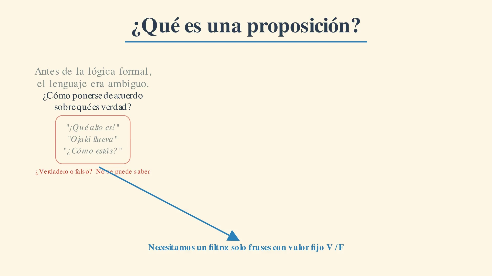

# Maths — Matemática Discreta Animada

> Convertir apuntes de texto en videos estilo 3Blue1Brown con Manim + voz sincronizada (first-principles).

[](https://docs.manim.community) [](https://github.com/rany2/edge-tts) [](LICENSE) [](PROMPT_MANIM.md)

---

## 🎬 Demo — Módulo 1.1: ¿Qué es una proposición?

**Video final 1080p60 con voz (79s):** `discrete_maths/media/videos/escenas_modulo1_sync/1080p60/Escena11_Proposicion_SYNC.mp4`



> "Antes de la lógica formal, el lenguaje era ambiguo..." — Narrativa first-principles: Problema Original → Evolución → Aha! → Relevancia (`if(true)`)

*Voz:* `es-CO-GonzaloNeural` (Edge-TTS). Ver workflow en [PROMPT_MANIM.md §5](PROMPT_MANIM.md#5-sincronización-voz-video-crítico---leer-bugfix-2026-08-27).

Para verlo local:
```bash
open discrete_maths/media/videos/escenas_modulo1_sync/1080p60/Escena11_Proposicion_SYNC.mp4
# o preview 480p
open discrete_maths/media/videos/escenas_modulo1_sync/480p15/Escena11_Proposicion_SYNC.mp4
```

---

## 📚 Contenido

| Módulo | Fuente | Estado |
|--------|--------|--------|
| **1. Lógica Proposicional** | [`discrete_maths/logica_proposicional`](discrete_maths/logica_proposicional) (343 líneas) | 1.1 ✅ 79s SYNC / 1.2 ⏳ |
| **2. Teoría de Conjuntos** | [`discrete_maths/teoria_de_conjuntos.md`](discrete_maths/teoria_de_conjuntos.md) (267 líneas) | ⏳ |
| Plan detallado | [`discrete_maths/animaciones/modulo1/00_PLAN.md`](discrete_maths/animaciones/modulo1/00_PLAN.md) | 6 videos ordenados |

Cada video sigue el prompt pedagógico de 4 fases: **Problema Original → Evolución Intuitiva → Aha! → Relevancia Actual** (ver [PROMPT_MANIM.md §3](PROMPT_MANIM.md#3-prompt-pedagógico-core)).

---

## 🚀 Quick Start

**Requisitos:** Python 3.12, ffmpeg, TeX Live, sox
```bash
pip install manim==0.21.0 manim-voiceover edge-tts
manim --version # 0.21.0
```

**1. Generar voz (75.88s total, 7 segmentos):**
```bash
cd discrete_maths
python3 animaciones/modulo1/generar_voz.py
ffprobe -v error -show_entries format=duration -of csv=p=0 animaciones/modulo1/voiceovers/combined_11.mp3
# s01 9.09 s02 9.69 s03 11.06 s04 11.88 s05 12.67 s06 13.2 s07 8.28
```

**2. Render (preview vs final):**
```bash
# Preview rápido 480p15 (1.7M, borroso)
manim -ql animaciones/modulo1/escenas_modulo1_sync.py Escena11_Proposicion_SYNC

# Final nítido 1080p60 (3.5M, 1920x1080)
manim -qh animaciones/modulo1/escenas_modulo1_sync.py Escena11_Proposicion_SYNC
```

**3. Ver docs para retomar con otro agente:**
```bash
cat ../PROMPT_MANIM.md
```

---

## 🎨 Estilo Visual

* **Fondo papel:** `#FDF6E3`, tinta `#2C3E50`, acentos `#2980B9`/`#E67E22`
* **Whiteboard:** `Write()` lento, 1 idea por pantalla, mucho espacio negativo
* **Analogías:** Tarjetas V/F, interruptores + bombilla, Venn — ver [PROMPT §4](PROMPT_MANIM.md#4-estilo-visual-minimalista)

---

## 📂 Estructura

```
maths/
├── PROMPT_MANIM.md               # Maestro (setup, sync, timeline)
├── README.md                     # Este archivo
├── discrete_maths/
│   ├── logica_proposicional
│   ├── teoria_de_conjuntos.md
│   └── animaciones/modulo1/
│       ├── 00_PLAN.md
│       ├── escenas_modulo1_sync.py  # ✅ Canónico (79s SYNC)
│       ├── generar_voz.py
│       └── voiceovers/combined_11.mp3
└── docs/thumb_11.jpg
```

Videos `*.mp4` y `media/` están en `.gitignore` (pesados). Ver `PROMPT_MANIM.md §2` para regenerar.

---

## 🔄 Para el próximo agente

1. `Read PROMPT_MANIM.md` (bugfix sync §5 es crítico)
2. Valida `Escena11_SYNC` que *"ninguna de las dos es proposición"* aún muestre las 4 tarjetas
3. Siguiente: `1.2 NOT/AND/OR` con mismo workflow `single combined audio`

Repo: `https://github.com/ivaniuss/maths`
